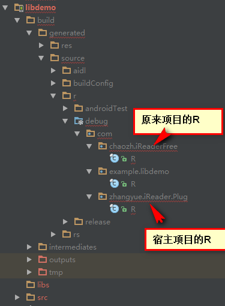

## android sdk 开发的三种模式 ##

> Android sdk开发，就是比如：我的项目做得很好，有人想在自己的app里面接入我的项目。那么我们就可以把自己的项目做成sdk,然后让第三方去接入。

## 第一种 动态加载：##
原理：dexclassder去加载dex文件。

## 第二种 依赖model：##
依赖model，就是把你的原来的项目改为model,在stadio 里面需要改两个地方：

1. apply plugin: 'com.android.library'
2. // applicationId "com.chaozh.iReaderFree"注释掉你的applicationId

然后，执行：assemblerelease，就会在如图下生成一个class.jar,如果你配置了混淆，那么这个jar是混淆的。而且，你引用的所有的第三方jar都会合并到这个class.jar里面。也就是这个jar就是你所有的jar的大杂烩。

然后你就可以把你的源代码和第三方jar全都删了，然后把项目给到第三方，让他们导入model，并依赖，就可以通过Intent启动我们的项目。

注意：
因为以model的形式，as编译的时候会编译出来两个R，一个是宿主项目的R，一个是你自己工程的R.(因为你原来的代码里面肯定有R.layout.xxx).如下图：

注意：可能需要一定的环境：
根环境的 build.gradle

	// Top-level build file where you can add configuration options common to all sub-projects/modules.
	buildscript {
	    repositories {
	        jcenter()
	    }
	    dependencies {
	        classpath 'com.android.tools.build:gradle:1.3.0'
	        classpath 'com.droidtitan:lint-cleaner-plugin:0.3.0'
	    }
	}
	
	allprojects {
	    repositories {
	        jcenter()
	    }
	}

gradle-wrapper.properties

	#Tue Apr 11 21:52:30 CST 2017
	distributionBase=GRADLE_USER_HOME
	distributionPath=wrapper/dists
	zipStoreBase=GRADLE_USER_HOME
	zipStorePath=wrapper/dists
	distributionUrl=https\://services.gradle.org/distributions/gradle-2.14.1-all.zip

## 第三种 给到自己项目的jar,so,res,声明：##

这种方式和第二种差不多，但是，有区别的就是你的R文件是没有的。因为你把自己的class文件，so,res，清单声明都给到第三方，但是会出现一个问题，就是R文件。因为你自己的class.jar里面肯定会有R.layou.xxx,所以，肯定会报错R.layou.xxx找不到，因为你的代码里面的R和宿主的R，不是一个R。

你需要做的，就是把你的工程的名字改成了宿主的名字一样，然后生成一个class.jar,这样，你就可以使用宿主的资源了。

Android stadio修改包名会有很多问题，因为你引入了很多的com.xxx.xxx.R,
那么怎么办呢？

	package com.***.res;

	public class R {
		public static com.example.myapplication.R.layout 		layout;
		public static com.example.myapplication.R.string 		string;
		public static com.example.myapplication.R.array 		array;
		public static com.example.myapplication.R.attr 		attr;
		public static com.example.myapplication.R.drawable 	drawable;
		public static com.example.myapplication.R.id 			id;
		public static com.example.myapplication.R.style 		style;
		public static com.example.myapplication.R.styleable 	styleable;
		public static com.example.myapplication.R.anim			anim;
		public static com.example.myapplication.R.color		color;
		public static com.example.myapplication.R.raw			raw;
		public static com.example.myapplication.R.dimen		dimen;
		public static com.example.myapplication.R.integer		integer;
	}

你的所有的setContentView(R.layout.xxx)的R导入com.***.res.R就可以了。做了一个映射关系。当然，这个还可以再优化，就是把所有的com.example.myapplication当做一个变量提取出来，以后你想改包名，很轻松。改一下清单文件里面的package,还有就是这里的，就ok了。

这样生成的class.jar是可以访问到宿主的资源的，因为都是一样的com.example.myapplication.R。

注意：如果你的项目本身引用了其他的model，你还想把你的项目当做sdk提供给第三方，那么，你要注意，你项目依赖的model的class是不会被打包进你的项目的，你需要手动把所有的class.jar都复制过去。这个好坑，当时我的插进就是。

## 第四种 aar：##
aar缺点：
1. aar的项目的minSdkVersion 19 的话，那么宿主的最小的不能低于19
2. tools:replace="android:icon,android:theme"

Check out on the github [Fork me on github][Tomas' Yu] for more info on how to get the most out of Jekyll. That's all,thanks !

[Tomas' Yu]: https://github.com/TomasYu/blogs
[Tomas' Yu]: https://github.com/TomasYu/blogs
