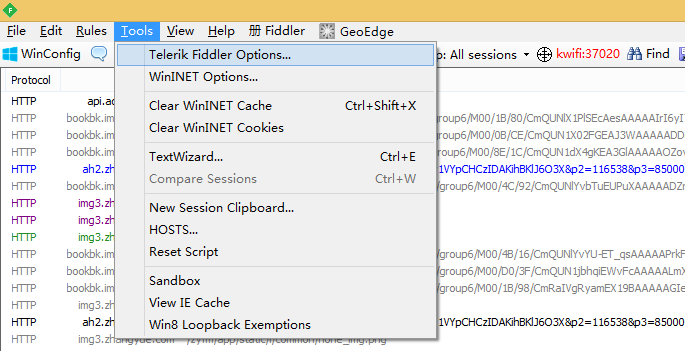
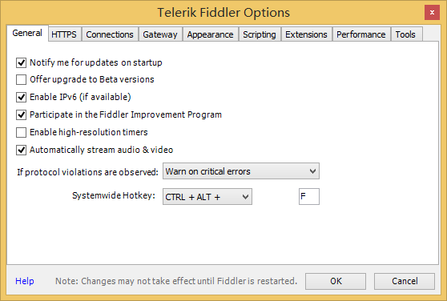
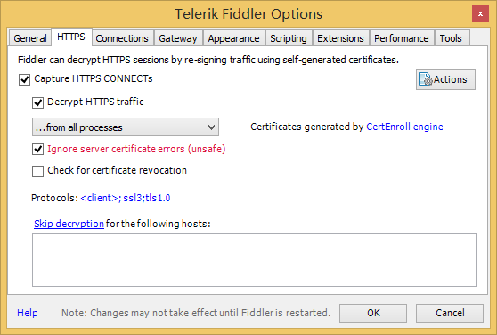
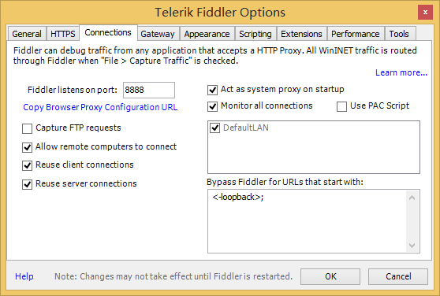
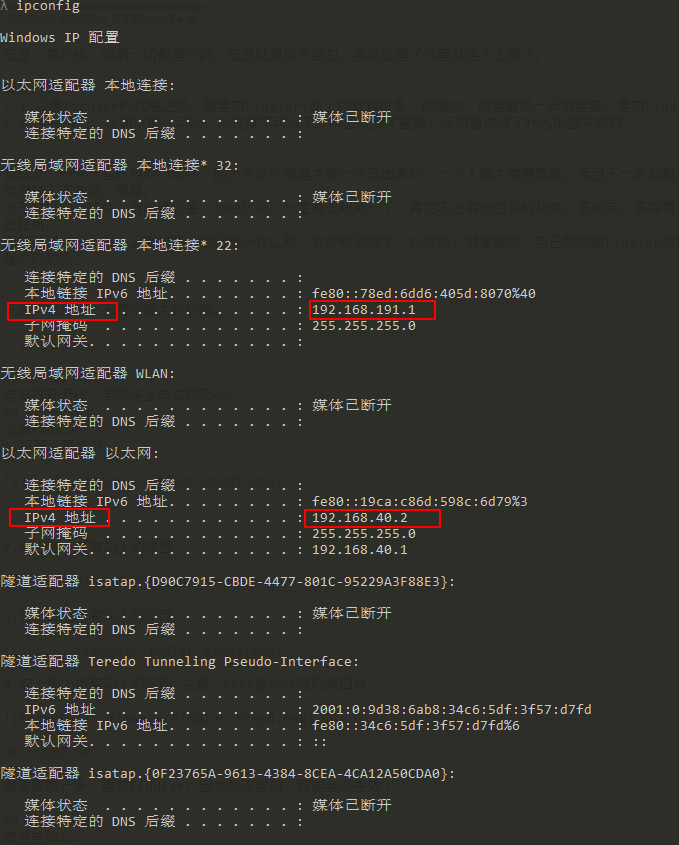
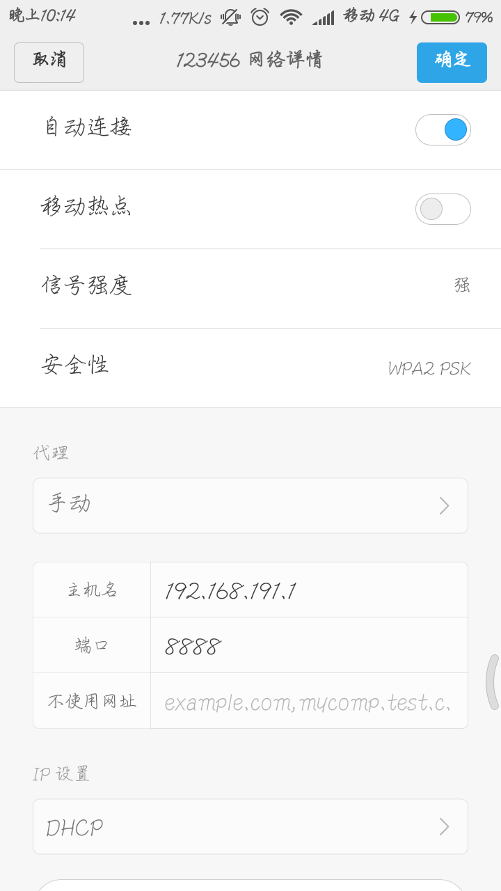
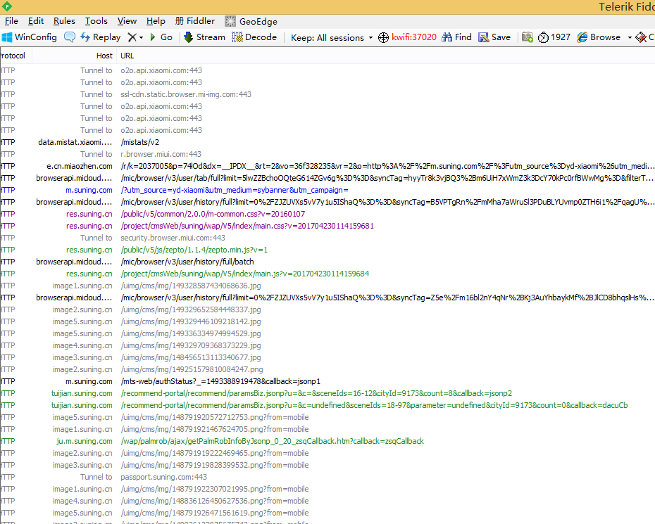
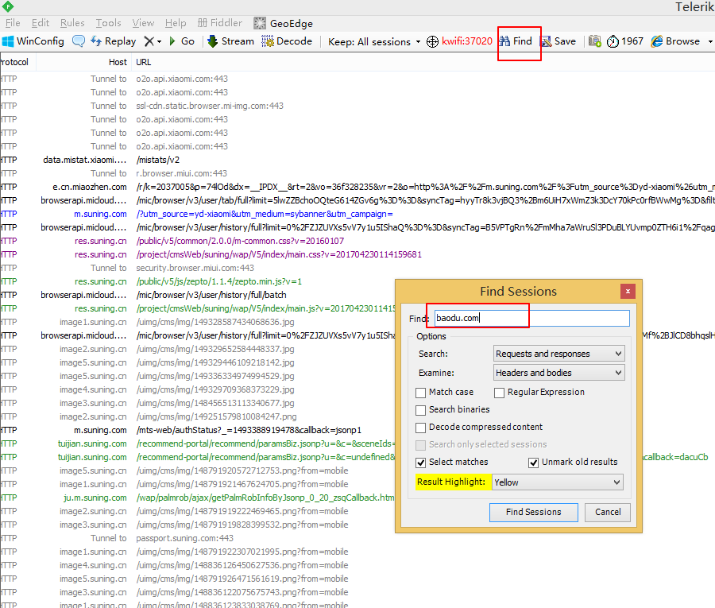
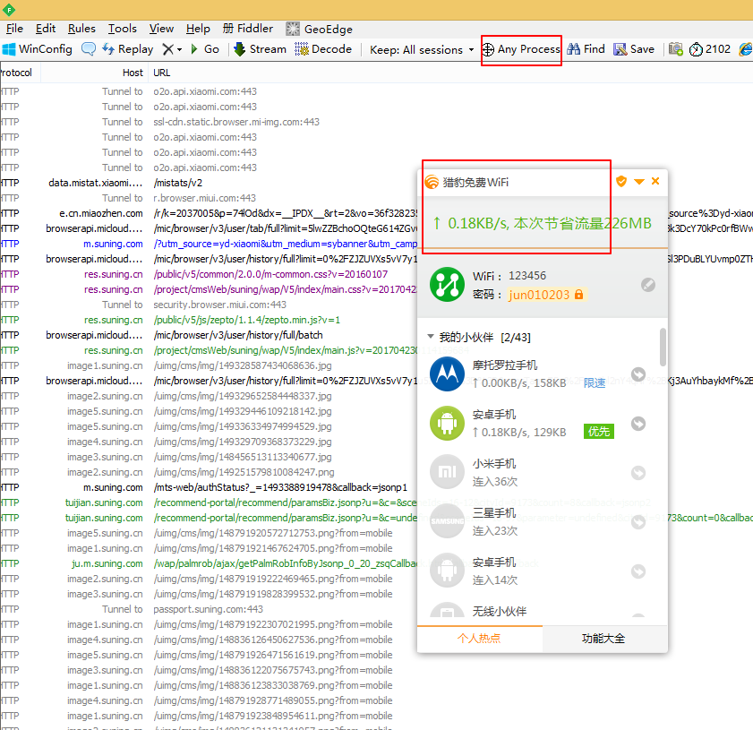

Fiddler 抓手机包

用猎豹wifi开一个热点，或者小米wifi开一个热点，然后手机连上电脑wifi，然后设置Fiddler代理就可以抓包了。

但是，有时候，明明一切都是对的，但是就是抓不到包，手机设置了代理就连不上网了。

解决方案：
> 1.设置Fiddler的代理之后，要重启Fiddler.网上的教程很多，都很对，但是最后一步很重要，重启Fiddler.
> 2.实在不行，比如以前还可以，现在就不可以了，那么就卸了重装，不知道你改了什么配置导致的。

我喜欢，研究一些好用的小软件，因为大软件都是大家一块写出来的，一个人盖大楼要累死，而且不一定有耐心和能力去盖出来。一些好用的软件，让你提升工作效率，很棒。
对于这样的小软件，我的建议是，你抽时间，一定要去研究一下，肯定不止有你想到的功能，多点点，多看看，多尝试尝试。就像Fiddler，真的是，很好用。
而我花了半个小时，上面的每个按钮是干什么的，我都研究透了，以前的，就是很忙，自己就知道Fiddler抓包就行了，根本没有想过Fiddler的其他强大的功能。

下面，我介绍一下两个强大的功能。

# 1.手机抓包 #

## step1 ##
电脑打开无线，手机连上电脑的无线。
## step2 ##
设置Fiddler
1.打开设置选项

2.勾上图上所有勾上的东西

3.勾上图上所有勾上的东西

4.勾上图上所有勾上的东西 注意：8888是你代理的端口号

## step3 ##

很重要的一步，重启Fiddler。因为你不重启，可能会不生效！

## step4 ##
查看电脑ip

cmd ---输入  ipconfig

可以看到有很多的ip,你只需要看ipv4的，我这里只有两个，一般都是192.168.191.1。

## step5 ##

打开手机wifi的设置，给连接到电脑的wifi设置加上代理。

OK了，大功告成。可以看一下。

Fiddler很强大，而且可以过滤你想要的。

# Fiddler 更强技能 #

有一个问题，电脑那么多应用都访问网络，我的手机的包总是被打断，被覆盖。怎么办？我就只想抓手机的包怎么办？

从上图可以看到有一个 Any process, 你鼠标左键点他，然后鼠标会变成一个十字架，你就把他拖到猎豹wifi上，他就会只抓猎豹wifi的包。

当然，Fiddler 还有很多其他的功能，你可以试着玩玩。反正，我本人喜欢玩软件，写软件，我觉得，小时候有小时候的爱好，长大了，又长大的爱好。我喜欢学习新的东西，喜欢尝试。

很好玩。能吸引我去做到哪里去写代码啊，学一门好玩的技术，比如gradle，花时间去研究一下平时没有时间研究的软件。特别棒。我觉得，一个人应该知道自己，要做点什么，要做点什么玩玩。

Check out on the github [Fork me on github][Tomas' Yu] for more info on how to get the most out of Jekyll. That's all,thanks !

[Tomas' Yu]: https://github.com/TomasYu/blogs
[Tomas' Yu]: https://github.com/TomasYu/blogs