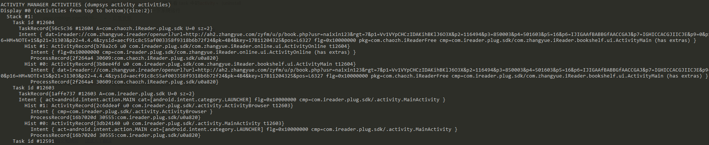
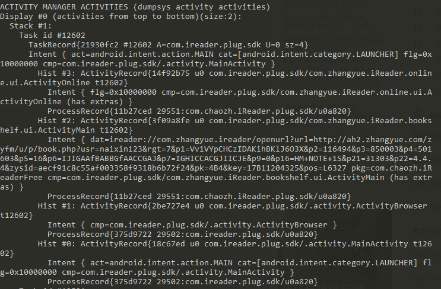

## Android taskAffinity ##

1.为什么android taskAffinity 属性必须和 intent.addFlags(Intent.FLAG_ACTIVITY_NEW_TASK); 一块使用才在一个堆栈里面？

我在stackOverFlow 找到了答案：
[https://stackoverflow.com/questions/21374610/use-of-android-taskaffinity](https://stackoverflow.com/questions/21374610/use-of-android-taskaffinity)

> When you call startActivity() to transition from one Activity to another, if you do not set Intent.FLAG_ACTIVITY_NEW_TASK in the Intent flags, the new Activity will be started in the same task,
>  regardless of the value of taskAffinity.
> 
> However, if you set Intent.FLAG_ACTIVITY_NEW_TASK in the Intent flags, the new Activity will still be started in the same task if the new Activity has the same taskAffinity as the taskAffinity of the task (this is determined by the taskAffinity of the root Activity in the task). But, if the new Activity has a different taskAffinity, the new Activity will be started in a new task.
> 
> Based on your description, if you don't set Intent.FLAG_ACTIVITY_NEW_TASK when starting a new Activity, then all of your activities will end up in the same task.

那怎么看两个activity 有没有在一个堆栈里面呢？怎么看手机activity 堆栈信息呢？

## step1 ##
> adb shell dumpsys activity

可参考：[http://blog.iderzheng.com/debug-activity-task-stack-with-adb-shell-dumpsys/](http://blog.iderzheng.com/debug-activity-task-stack-with-adb-shell-dumpsys/)

## step2 ##
然后,查看就行了。比如：

其中一个task id 表示一个堆栈。 一个hist 表示一个activity实例。
如图：ActivityBrowser 位于 task id 12603 的hist 1.
而 ActivityMain 位于 task id 12604的 hist 0 ,两个activity 不在同一个堆栈。

ActivityBrowser  和 ActivityMain 位于同一个堆栈。

Check out on the github [Fork me on github][Tomas' Yu] for more info on how to get the most out of Jekyll. That's all,thanks !

[Tomas' Yu]: https://github.com/TomasYu/blogs
[Tomas' Yu]: https://github.com/TomasYu/blogs