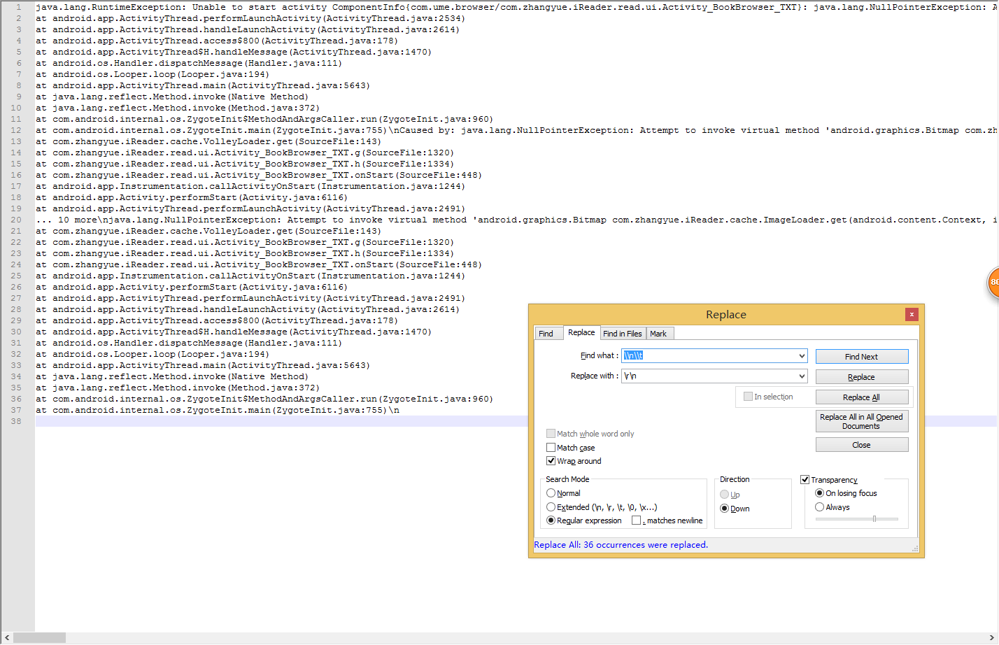

# 错误日志格式化 #

崩溃日志是肯定要收集的，收集上来之后的样式，是不容易观察的：

> java.lang.RuntimeException: Unable to start activity ComponentInfo{com.ume.browser/com.zhangyue.iReader.read.ui.Activity_BookBrowser_TXT}: java.lang.NullPointerException: Attempt to invoke virtual method 'android.graphics.Bitmap com.zhangyue.iReader.cache.ImageLoader.get(android.content.Context, int)' on a null object reference\n\tat android.app.ActivityThread.performLaunchActivity(ActivityThread.java:2534)\n\tat android.app.ActivityThread.handleLaunchActivity(ActivityThread.java:2614)\n\tat android.app.ActivityThread.access$800(ActivityThread.java:178)\n\tat android.app.ActivityThread$H.handleMessage(ActivityThread.java:1470)\n\tat android.os.Handler.dispatchMessage(Handler.java:111)\n\tat android.os.Looper.loop(Looper.java:194)\n\tat android.app.ActivityThread.main(ActivityThread.java:5643)\n\tat java.lang.reflect.Method.invoke(Native Method)\n\tat java.lang.reflect.Method.invoke(Method.java:372)\n\tat com.android.internal.os.ZygoteInit$MethodAndArgsCaller.run(ZygoteInit.java:960)\n\tat com.android.internal.os.ZygoteInit.main(ZygoteInit.java:755)\nCaused by: java.lang.NullPointerException: Attempt to invoke virtual method 'android.graphics.Bitmap com.zhangyue.iReader.cache.ImageLoader.get(android.content.Context, int)' on a null object reference\n\tat com.zhangyue.iReader.cache.VolleyLoader.get(SourceFile:143)\n\tat com.zhangyue.iReader.read.ui.Activity_BookBrowser_TXT.g(SourceFile:1320)\n\tat com.zhangyue.iReader.read.ui.Activity_BookBrowser_TXT.h(SourceFile:1334)\n\tat com.zhangyue.iReader.read.ui.Activity_BookBrowser_TXT.onStart(SourceFile:448)\n\tat android.app.Instrumentation.callActivityOnStart(Instrumentation.java:1244)\n\tat android.app.Activity.performStart(Activity.java:6116)\n\tat android.app.ActivityThread.performLaunchActivity(ActivityThread.java:2491)\n\t... 10 more\njava.lang.NullPointerException: Attempt to invoke virtual method 'android.graphics.Bitmap com.zhangyue.iReader.cache.ImageLoader.get(android.content.Context, int)' on a null object reference\n\tat com.zhangyue.iReader.cache.VolleyLoader.get(SourceFile:143)\n\tat com.zhangyue.iReader.read.ui.Activity_BookBrowser_TXT.g(SourceFile:1320)\n\tat com.zhangyue.iReader.read.ui.Activity_BookBrowser_TXT.h(SourceFile:1334)\n\tat com.zhangyue.iReader.read.ui.Activity_BookBrowser_TXT.onStart(SourceFile:448)\n\tat android.app.Instrumentation.callActivityOnStart(Instrumentation.java:1244)\n\tat android.app.Activity.performStart(Activity.java:6116)\n\tat android.app.ActivityThread.performLaunchActivity(ActivityThread.java:2491)\n\tat android.app.ActivityThread.handleLaunchActivity(ActivityThread.java:2614)\n\tat android.app.ActivityThread.access$800(ActivityThread.java:178)\n\tat android.app.ActivityThread$H.handleMessage(ActivityThread.java:1470)\n\tat android.os.Handler.dispatchMessage(Handler.java:111)\n\tat android.os.Looper.loop(Looper.java:194)\n\tat android.app.ActivityThread.main(ActivityThread.java:5643)\n\tat java.lang.reflect.Method.invoke(Native Method)\n\tat java.lang.reflect.Method.invoke(Method.java:372)\n\tat com.android.internal.os.ZygoteInit$MethodAndArgsCaller.run(ZygoteInit.java:960)\n\tat com.android.internal.os.ZygoteInit.main(ZygoteInit.java:755)\n

怎么办？

> 注意几点：

1. 开启正则表达式
2. \\n\\t 转义
3. \r\n 换行

转换之后：
java.lang.RuntimeException: Unable to start activity ComponentInfo{com.ume.browser/com.zhangyue.iReader.read.ui.Activity_BookBrowser_TXT}: java.lang.NullPointerException: Attempt to invoke virtual method 'android.graphics.Bitmap com.zhangyue.iReader.cache.ImageLoader.get(android.content.Context, int)' on a null object reference
at android.app.ActivityThread.performLaunchActivity(ActivityThread.java:2534)
at android.app.ActivityThread.handleLaunchActivity(ActivityThread.java:2614)
at android.app.ActivityThread.access$800(ActivityThread.java:178)
at android.app.ActivityThread$H.handleMessage(ActivityThread.java:1470)
at android.os.Handler.dispatchMessage(Handler.java:111)
at android.os.Looper.loop(Looper.java:194)
at android.app.ActivityThread.main(ActivityThread.java:5643)
at java.lang.reflect.Method.invoke(Native Method)
at java.lang.reflect.Method.invoke(Method.java:372)
at com.android.internal.os.ZygoteInit$MethodAndArgsCaller.run(ZygoteInit.java:960)
at com.android.internal.os.ZygoteInit.main(ZygoteInit.java:755)\nCaused by: java.lang.NullPointerException: Attempt to invoke virtual method 'android.graphics.Bitmap com.zhangyue.iReader.cache.ImageLoader.get(android.content.Context, int)' on a null object reference
at com.zhangyue.iReader.cache.VolleyLoader.get(SourceFile:143)
at com.zhangyue.iReader.read.ui.Activity_BookBrowser_TXT.g(SourceFile:1320)
at com.zhangyue.iReader.read.ui.Activity_BookBrowser_TXT.h(SourceFile:1334)
at com.zhangyue.iReader.read.ui.Activity_BookBrowser_TXT.onStart(SourceFile:448)
at android.app.Instrumentation.callActivityOnStart(Instrumentation.java:1244)
at android.app.Activity.performStart(Activity.java:6116)
at android.app.ActivityThread.performLaunchActivity(ActivityThread.java:2491)
... 10 more\njava.lang.NullPointerException: Attempt to invoke virtual method 'android.graphics.Bitmap com.zhangyue.iReader.cache.ImageLoader.get(android.content.Context, int)' on a null object reference
at com.zhangyue.iReader.cache.VolleyLoader.get(SourceFile:143)
at com.zhangyue.iReader.read.ui.Activity_BookBrowser_TXT.g(SourceFile:1320)
at com.zhangyue.iReader.read.ui.Activity_BookBrowser_TXT.h(SourceFile:1334)
at com.zhangyue.iReader.read.ui.Activity_BookBrowser_TXT.onStart(SourceFile:448)
at android.app.Instrumentation.callActivityOnStart(Instrumentation.java:1244)
at android.app.Activity.performStart(Activity.java:6116)
at android.app.ActivityThread.performLaunchActivity(ActivityThread.java:2491)
at android.app.ActivityThread.handleLaunchActivity(ActivityThread.java:2614)
at android.app.ActivityThread.access$800(ActivityThread.java:178)
at android.app.ActivityThread$H.handleMessage(ActivityThread.java:1470)
at android.os.Handler.dispatchMessage(Handler.java:111)
at android.os.Looper.loop(Looper.java:194)
at android.app.ActivityThread.main(ActivityThread.java:5643)
at java.lang.reflect.Method.invoke(Native Method)
at java.lang.reflect.Method.invoke(Method.java:372)
at com.android.internal.os.ZygoteInit$MethodAndArgsCaller.run(ZygoteInit.java:960)
at com.android.internal.os.ZygoteInit.main(ZygoteInit.java:755)\n

Check out on the github [Fork me on github][Tomas' Yu] for more info on how to get the most out of Jekyll. That's all,thanks !

[Tomas' Yu]: https://github.com/TomasYu/blogs
[Tomas' Yu]: https://github.com/TomasYu/blogs