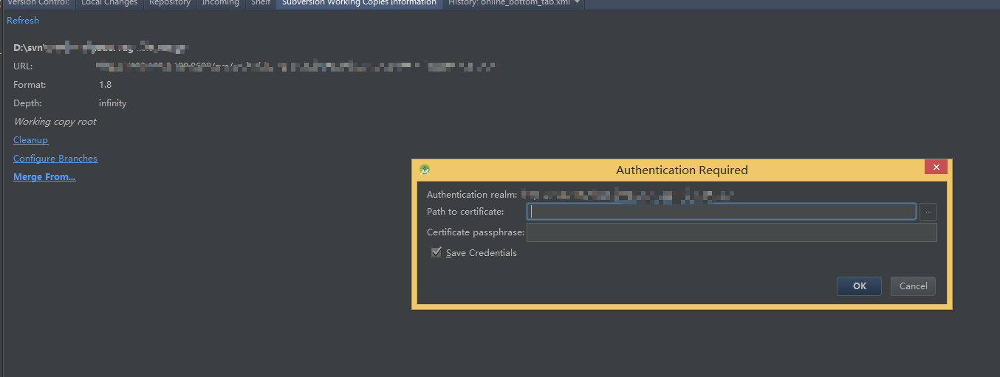

开发中，开发一个功能，拉一个分支过来，然后开发完了，合并到主线上。
这是很常用的。但是，android stadio的 svn 插件真的很不给力，每次都有问题。
比如：（见下图）

就是老提示这个。真烦，害的我一次都没有merge成功过。也没有想过为什么，
也没有想过去解决它，确实是我自己的问题。不过，这个问题我懒得解决了，
以后我就不打算用stadio自带的svn了。难用。

用小乌龟客户端，或者命令行吧。用法很简单，而且不会出现莫名其妙的问题。

----------

# svn 的merge : #

> 参考地址：
[http://www.cnblogs.com/liuzunli/articles/4481402.html](http://www.cnblogs.com/liuzunli/articles/4481402.html)
[http://blog.csdn.net/bbirdsky/article/details/24620155](http://blog.csdn.net/bbirdsky/article/details/24620155)

随便一学就会了。别说，软件还是专业的好。以后也不要死脑筋了，这个方法，
这个方式不行，就换一个。毕竟只是android stadio的一个插件。

Check out on the github [Fork me on github][Tomas' Yu] for more info on how to get the most out of Jekyll. That's all,thanks !

[Tomas' Yu]: https://github.com/TomasYu/blogs
[Tomas' Yu]: https://github.com/TomasYu/blogs