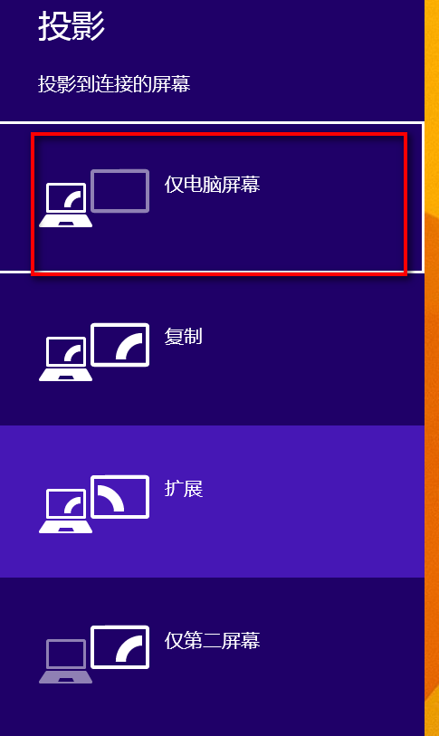

# 电脑扩展屏不清晰 #

作为一个开发人员，有两个显示器是很真长的事情。比如我现在笔记本一个屏幕，显示器一个屏幕。后来我发现一个问题，就是电脑屏幕很清晰的时候，外接显示器很不清晰。当外接显示器很清晰的时候，笔记本屏幕很不清晰。

	后来无意中的一次电脑重启让我发现了问题，就是，
	如果你选择的是只显示电脑屏幕，然后重启电脑，	电脑屏幕就很清晰，扩展屏幕就很不清晰。	
	如果你选择的只显示第二屏，然后重启，那么你的电脑的就很不清晰。

## 结论 ##

- 如果你想让电脑屏幕清晰，那么请选择只显示电脑屏幕，然后重启
- 如果你想让外接屏幕清晰，那么请选择只显示第二屏，然后重启

## 备注 ##

Check out on the github [Fork me on github][Tomas' Yu] for more info on how to get the most out of Jekyll. That's all,thanks !

[Tomas' Yu]: https://github.com/TomasYu/blogs
[Tomas' Yu]: https://github.com/TomasYu/blogs
